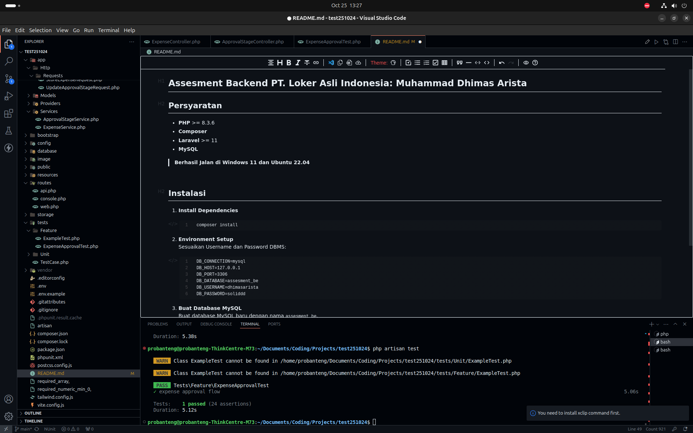

# Assesment Backend PT. Loker Asli Indonesia: Muhammad Dhimas Arista

## Persyaratan

- **PHP** >= 8.3.6
- **Composer**
- **Laravel** >= 11
- **MySQL**

> **Berhasil Jalan di Windows 11 dan Ubuntu 22.04**



## Instalasi

1. **Install Dependencies**

   ```bash
   composer install
   ```
2. **Environment Setup**
   Sesuaikan Username dan Password DBMS:

   ```bash
   DB_CONNECTION=mysql
   DB_HOST=127.0.0.1
   DB_PORT=3306
   DB_DATABASE=assesment_be
   DB_USERNAME=dhimasarista
   DB_PASSWORD=soliddd
   ```
3. **Buat Database MySQL**
   Buat database MySQL baru dengan nama `assesment_be`.
4. **Migrasi Database**
   Jalankan migrasi untuk membuat tabel yang dibutuhkan

   ```bash
   php artisan migrate
   ```
5. **Jalankan Aplikasi**

   ```bash
   php artisan serve
   ```

Aplikasi akan berjalan di `http://127.0.0.1:8000`.

##### Terakhir Menjalankan PHPUnit sesuai Instruksi dengan perintah PHP ARTISAN TEST
